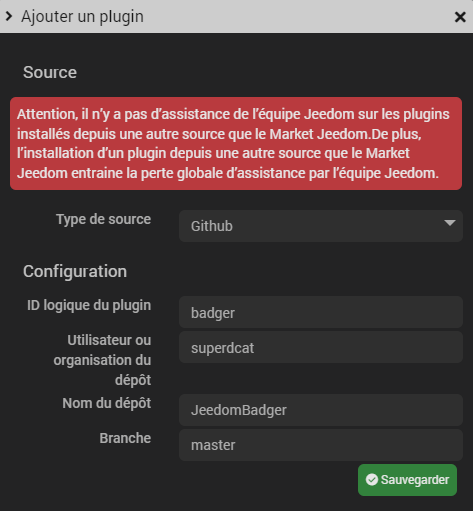

# Badger

## Description

Ce plugin permet de connecter des lecteurs de badges (RFID/NFC) utilisant le protocole Wiegand (8/26/34). Ce plug-in nécessite un composant tiers (Arduino) comme interface entre le lecteur et le réseau local.

## Installation

Dans jeedom, allez dans "Plugins" > "Gestion des plugins"
cliquez ensuite sur le bouton

Enfin paramétrez la fenêtre de cette sorte :

## Configuration

---

[Configuration du plugin](configuration.md)

## Fonctionnement

---

[Fonctionnement et utilisation des equipements](fonctionement.md)

## Infos techniques

---

[Infos techniques](techtips.md)
